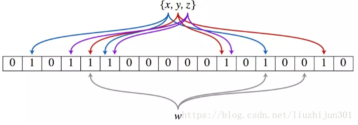
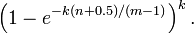
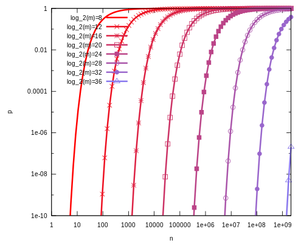

1 布隆过滤器原理

布隆过滤器一般用来判断一个数据是否在一个很大的数据集合里面。当然可以用数组，集合，树等数据结构和各种查找法都可以做同样的事情，但是布隆过滤器有更好的时间效率和空间效率。比特币实现SPV节点时使用了布隆过滤器来查询交易。布隆过滤器可以判断一个数在不在集合里，但存在一定的误判率。

布隆过滤器的核心是一个超大的位数组和几个哈希函数。假设位数组的长度为m,哈希函数的个数为k。

以上图为例，在这里维数组长度为18，哈希函数个数为3个。首先将维数组所有位全部置0。集合中有的3个数据x,y,z，通过3个哈希函数对每一个数据进行计算，得到该数据的哈希值，这个哈希值对应维数组上面的一个点，然后将对应位数组的位置1。这样3个数据会生成9个点。对于另外一个数据w，查询它 在不在集合中的方法是对w通过3个哈希函数映射到位数组上，判断3个映射位置是否为1。只要有一个位置为0，就能说明w一定不在集合中。反之如果3个点都为1，则说明这个元素可能在集合中。此处不能判断元素一定在集合中，因为存在一定的误判率。比如对于上图中的4,5,6这3个位置都为1，但是它是不同的数据映射到的点。如果有一个数据刚好映射到这3个位置，虽然它不在集合中，但是我们也会误判它。

添加元素

- 将要添加的元素给k个哈希函数进行计算
- 得到位于位数组上面的k个位置
- 将位数组上对应位置1

查询元素

- 将要查询的元素给k个哈希函数
- 得到对应于位数组上的k个位置
- 如果k个位置有一个为0，则肯定不在集合中
- 如果k个位置全部为1，则可能在集合中

假正率计算
m 是该位数组的大小，k 是 Hash 函数的个数 插入元素个数 n，对于给定的 m，n，k，假正例概率最大为：

下图是布隆过滤器假正例概率 p 与位数组大小 m 和集合中插入元素个数 n 的关系图，假定 Hash 函数个数选取最优数目：k = (m/2)In2

